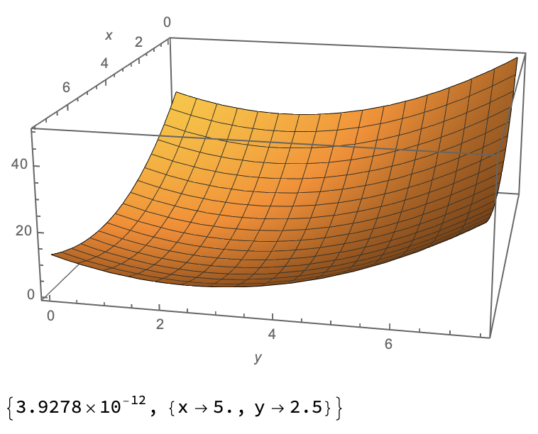
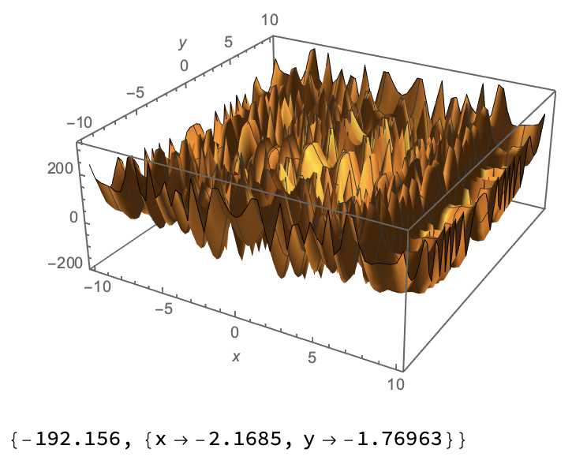
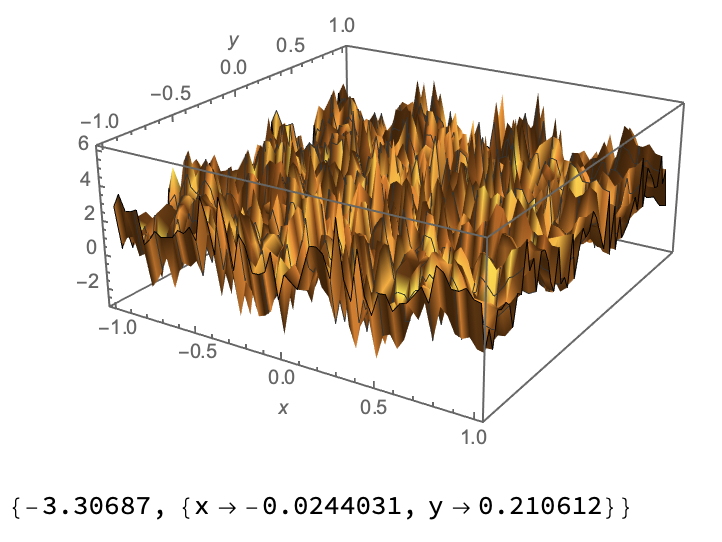
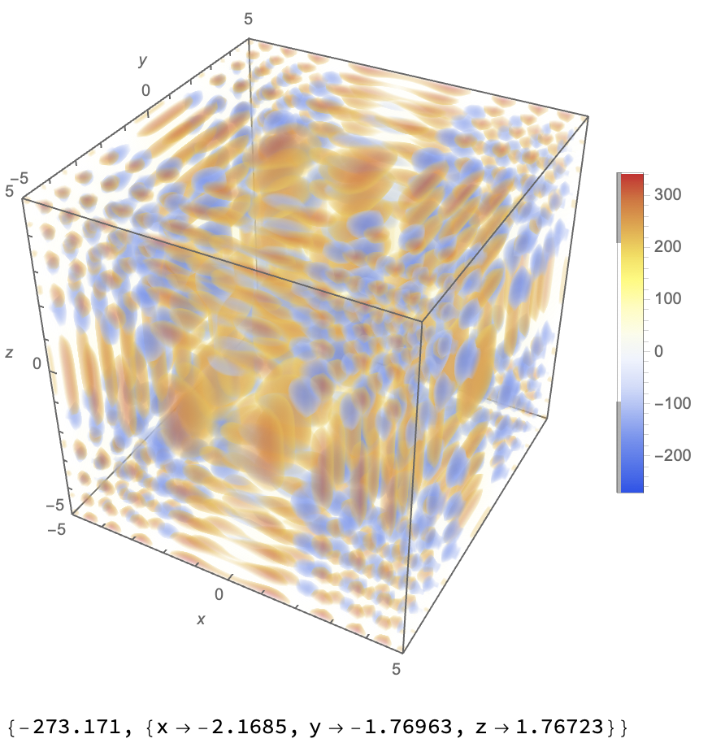

# Generic Function Optimizer via Particle Swarm Algorithm (PSO)

In this project, we write a 'PSO_Optimizer' class that is capable to minimize functions with arbitrary number of variables (dimensions). We test its performance with 4 functions with increasing complexity or dimension. Their plots along with the optimization results gotten by Mathematica are as follows:

