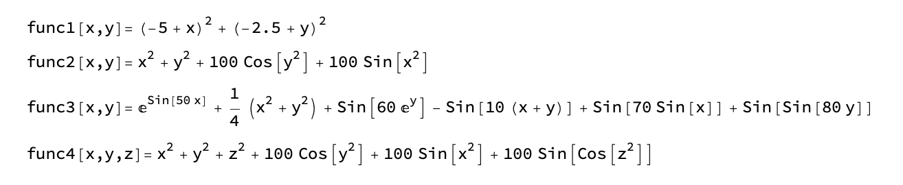

# Generic Function Optimizer via Particle Swarm Algorithm (PSO)

In this project, we write a 'PSO_Optimizer' class that is capable to minimize functions with arbitrary number of variables (dimensions). We test its performance with 4 functions with increasing complexity or dimension:

Their plots along with the optimization results gotten by Mathematica are as follows:

The optimizer can accurately locate the minimum of all 4 functions with high efficiency. For example, with 600 particles and 100 iterations, it only takes about 0.05 seconds to finish minimizing func4.

One huge advantage of PSO algorithm is that it can also minimize function without an explicit expression, which is extremely useful for some complex systems thus being used broadly.
